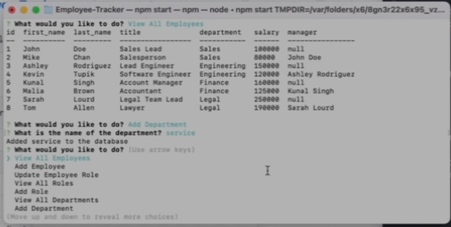

# Employee Tracker

[](https://opensource.org/licenses/ISC)

## Description

This Node.js command-line application manages a company's employee database. I utilized the [MySQL2 package](https://www.npmjs.com/package/mysql2) to connect to your MySQL database and perform queries, the [Inquirer package](https://www.npmjs.com/package/inquirer) to interact with the user via the command line, and the [console.table package](https://www.npmjs.com/package/console.table) to print MySQL rows to the console.

## Table of Contents

- [Installation](#installation)
- [Usage](#usage)
- [Product](#product)
- [Questions](#questions)
- [Technology](#technology)
- [License](#license)

## Installation

Prerequisites: Node, NPM and MySQL

```bash
git clone git@github.com:brianbixby/Employee-Tracker.git
cd Employee-Tracker
npm i
mysql -u root -p
*** enter your password for mysql ***
SOURCE db/schema.sql;
SOURCE db/seeds.sql;
*** \q to exit mysql ***
```

## Usage

- Update the index.js on line 11 with your mysql password
- The application will be invoked by using the following command:

```bash
npm start
```

## Product


[Walkthrough video that demonstrates the functionality](https://watch.screencastify.com/v/D5wKfMTmbuyVz9xzEpGK)

## Questions

If you have any questions please don't hesitate to reach out:
[Github](https://github.com/brianbixby)
[Email](mailto:brianbixby0@gmail.com)

## Technology

- [Github](https://github.com/brianbixby/Employee-Tracker)
- [Nodejs](https://nodejs.org/en/)
- [Inquirer](https://www.npmjs.com/package/inquirer)
- [MySQL2 package](https://www.npmjs.com/package/mysql2)
- [console.table package](https://www.npmjs.com/package/console.table)

## License

Copyright 2022 Brian Bixby

Permission to use, copy, modify, and/or distribute this software for any purpose with or without fee is hereby granted, provided that the above copyright notice and this permission notice appear in all copies.

THE SOFTWARE IS PROVIDED "AS IS" AND THE AUTHOR DISCLAIMS ALL WARRANTIES WITH REGARD TO THIS SOFTWARE INCLUDING ALL IMPLIED WARRANTIES OF MERCHANTABILITY AND FITNESS. IN NO EVENT SHALL THE AUTHOR BE LIABLE FOR ANY SPECIAL, DIRECT, INDIRECT, OR CONSEQUENTIAL DAMAGES OR ANY DAMAGES WHATSOEVER RESULTING FROM LOSS OF USE, DATA OR PROFITS, WHETHER IN AN ACTION OF CONTRACT, NEGLIGENCE OR OTHER TORTIOUS ACTION, ARISING OUT OF OR IN CONNECTION WITH THE USE OR PERFORMANCE OF THIS SOFTWARE.
